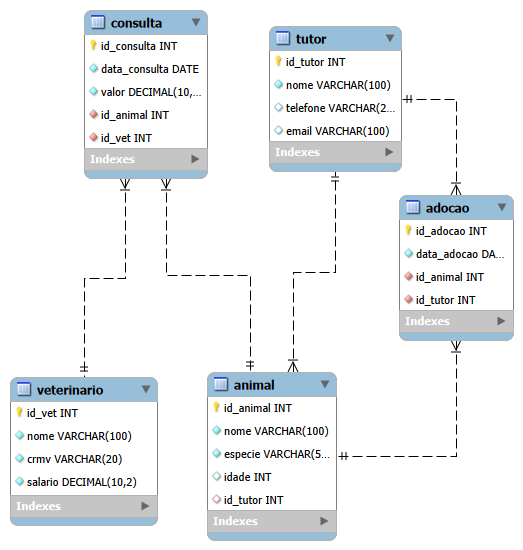

# Vet Pet - Sistema Integrado de Clínica Veterinária e Adoção de Animais

Este repositório contém o projeto final desenvolvido para a disciplina de **Laboratório de Banco de Dados (Turma: GPE01N30035)**. O objetivo do projeto é demonstrar o domínio prático em modelagem lógica, criação de esquemas (DDL), manipulação de dados (DML) e extração de relatórios estatísticos (DQL) utilizando o banco de dados MySQL.

## 📌 Sobre o Projeto
O sistema **Vet Pet** foi projetado para gerenciar de forma unificada as operações de uma clínica veterinária integrada a um centro de adoção de animais. O modelo abrange desde o cadastro inicial de tutores e médicos veterinários até o controle de prontuários de consultas e a formalização do processo de adoção de animais abandonados.

---

## 🗂️ Estrutura do Repositório

O repositório está organizado de forma sequencial para garantir a integridade referencial do banco de dados durante a execução:

1. **`diagrama_logico.png`**: Representação visual do Modelo Entidade-Relacionamento (Diagrama ER) gerada via Engenharia Reversa no MySQL Workbench.
2. **`1_ddl_criacao.sql`**: Script contendo a criação do schema `db_vetpet`, definição de tabelas, chaves primárias (`PRIMARY KEY` com `AUTO_INCREMENT`), chaves estrangeiras (`FOREIGN KEY`) e restrições de integridade.
3. **`2_dml_carga.sql`**: Script de carga inicial populando o banco com exatamente 100 registros consistentes e distribuídos entre todas as tabelas para simular um ambiente de produção.
4. **`3_dql_relatorios.sql`**: Script contendo consultas inteligentes para a extração de métricas de negócio, utilizando funções agregadas (`AVG`, `MAX`, `MIN`, `COUNT`, `SUM`), agrupamentos (`GROUP BY`) e junções de tabelas (`JOIN`).

---

## 📐 Modelo Lógico (Diagrama ER)

O diagrama abaixo ilustra como as entidades se relacionam no sistema. A tabela `Animal` atua como o núcleo do sistema, vinculando-se aos tutores (permitindo valores nulos para animais sem dono), enquanto as tabelas `Consulta` e `Adocao` gerenciam as transações financeiras e o fluxo de novos lares.

---

## 🚀 Como Executar o Projeto

Para replicar o ambiente localmente utilizando o MySQL Workbench ou qualquer SGBD compatível com MySQL, execute os scripts estritamente na ordem numérica indicada:

1. **Criação da Estrutura:** Execute integralmente o arquivo `1_ddl_criacao.sql` para construir o banco e as restrições relacionais.
2. **População do Banco:** Execute o arquivo `2_dml_carga.sql` para inserir a base de testes de 100 registros.
3. **Análise de Dados:** Execute o arquivo `3_dql_relatorios.sql` para visualizar os relatórios gerenciais e estatísticas na aba de resultados.

---

## 👥 Integrantes do Grupo
* [Rafaella Farias Lima]
* [Pedro Lucas Oliveira jacomes de Souza]
* [Murilo Lenildo de Castro Silva]
* [Nicole Emanuelle Lopes Da Silva Jana]

---
*Projeto desenvolvido para fins acadêmicos como critério de avaliação semestral.*
